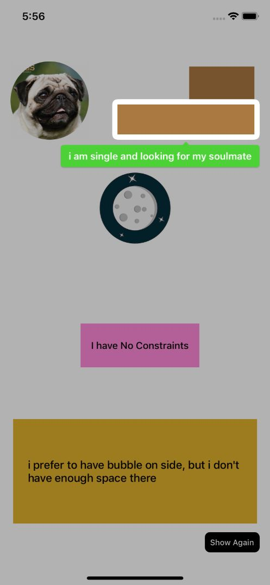
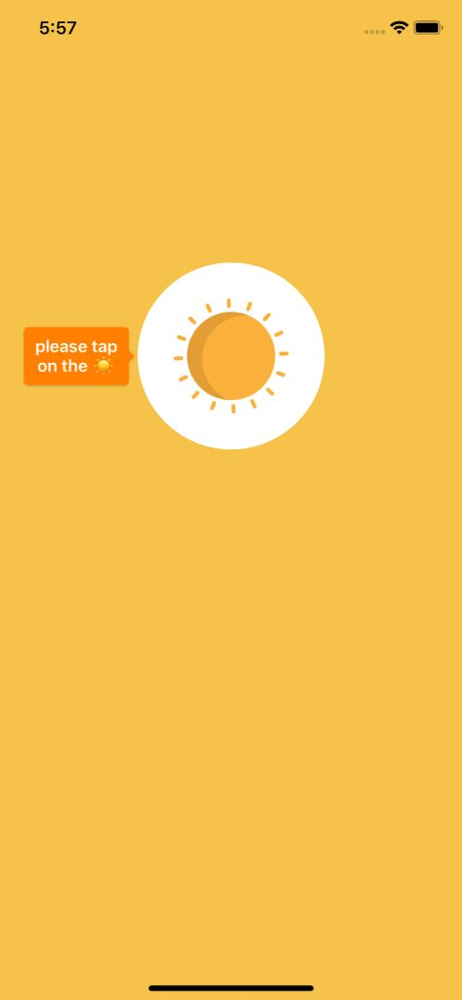
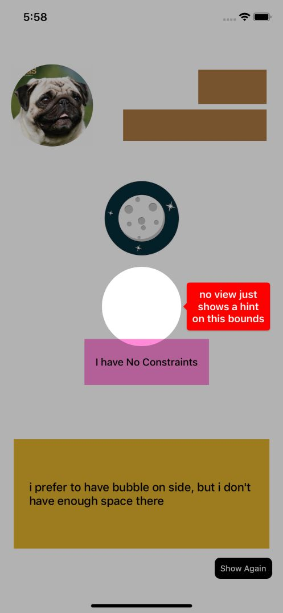

# TipC

[](https://travis-ci.org/farshadjahanmanesh/TipC)
[](https://cocoapods.org/pods/TipC)
[](https://cocoapods.org/pods/TipC)
[](https://cocoapods.org/pods/TipC)


What we can do with this library?
we can show interactive hint on top of the viewes or where ever we want but finding the best place to put the hint is based on the TipC decision. it would find best place to show the hint based on the available space and the content size smartly, we can show custom views or simple text as you've seen in the Gif. 

configs: 
there are two type of config, one for the whole and global thing(which will apply to all hints) and one specific configuration for each bubble. **HintPointer.Options** is the one we set to set a global configuration for all bubbles and **HintPointer.Options.Bubble** which is our configuration for each hint. it means that we can change the background color, font and ... for each color, or we can just set a general configuration for all hints. so we start with global one:
```swift
public struct Options: HintConfiguration {

    /// default dim's color, each bubble could changes this color(optionaly) by setting the bubble.dimBackgroundColor
    public var dimColor: UIColor

    /// bubble's life cycle.
    /// forEver : bubbles will be visible and needs to be remove manualy by caliing dismiss(item), you can show multiple bubbles same time
    /// untilNext: everytime show() function is called, previous bubble(if exists) will remove and new one will present
    public var bubbleLiveDuration: BubbleLiveDuration

    /// indicates the default bubble's position, each bubble can has specific position by setting bubble.position
    public var defaultBubblePosition: BubblePosition

    /// specifies the hole's(Target Area) radius
    /// keepTargetAreaCornerRadius : uses target view layer corner radius
    /// constantRadius(radius) : sets constant radius for all
    /// defaultOrGreater(default) : sets a constant default value or uses the target view layer corner radius if it is greater that the default value
    /// none : no corner rradius
    public var holeRadius: HoleRadius

    /// indicates bubble's margin with the target area
    public var safeAreaInsets: UIEdgeInsets

    /// if false, the dimTap Callback will not call. some times we need to let users to interact with the views behinde the dim
    public var absorbDimTouch : Bool

    /// if true, dim will fade after one second, combine this with absorbDimTouch if you want to have an interactive area while your hint is showing, by default, a dim will cover all the screen and user can not touch the things behind that dim
    public var dimFading : Bool


    /// bublbe's options. all bubbles will setup by this one if they will have not specified one for themself until presentaion. every bubble can has their own configuration and if we set specific configuration for a hint, that one will apply and this one is ignored
    public var bubbles: Bubble
    
}
```
**Bubble Options**
```swift 
public struct Bubble {
    
    /// bubble's background color
    public  var backgroundColor: UIColor
    
    /// preferred position for the bubble, this is preferred because sometimes there is not enough space there, TipC needs to choose a better place to put the bubble
    public  var position: BubblePosition?
    
    /// text font
    public  var font: UIFont
    
    /// text color
    public  var foregroundColor: UIColor
    
    /// text alignment
    public  var textAlignments: NSTextAlignment
    
    /// bubble's presentaion animation which is (bounce + fade-in), do you want your bubbles have?
    public  var hasAppearAnimation: Bool
    
    /// distance between the bubble and the target view
    public  var padding: UIEdgeInsets = .zero
    
    /// whole hint(dim and bubble) should be dismiss when user is touched on the target area
    public  var dismissOnTargetAreaTap: Bool
    
    /// will execute when user taps on target area
    public var onTargetAreaTap : TapGesture?
    
    /// each hint could has a different dim color which is viewable in the animation(sun and moon)
    public var changeDimColor : UIColor?
    
    /// will execute when user taps on the bubble
    public var onBubbleTap : TapGesture?
    
}
```

**Actions**
TipC has four actions which we can react to them
  1. Bubble.onBubbleTap when user clicks on the bubble view, we can access to tapped bubble and item 
  2. Bubble.onTargetAreaTap when user click on target area
  3. HintObject.onDimTap when user clicks on dim(background), we can access to latest hint on the screen 
  4. HintObject.onBubbleTap when user clicks on bubble, this is default action if the bubble has not specified one for itself


before we start talking about config, we need to know balut every hint life cycle, **we have two type of lifecycle for all hints, forEver or until next.** 

## DEMO
|   |   |   |
|---|---|---|
|   |   |   |


## Example

To run the example project, clone the repo, and run `pod install` from the Example directory first.

## Requirements
this library doe's not need any requirement and has written in Swift5.
## Installation

TipC is available through [CocoaPods](https://cocoapods.org). To install
it, simply add the following line to your Podfile:

```ruby
pod 'TipC'
```

## Author

farshadjahanmanesh, farshadjahanmanesh@gmail.com

## License

TipC is available under the MIT license. See the LICENSE file for more info.
